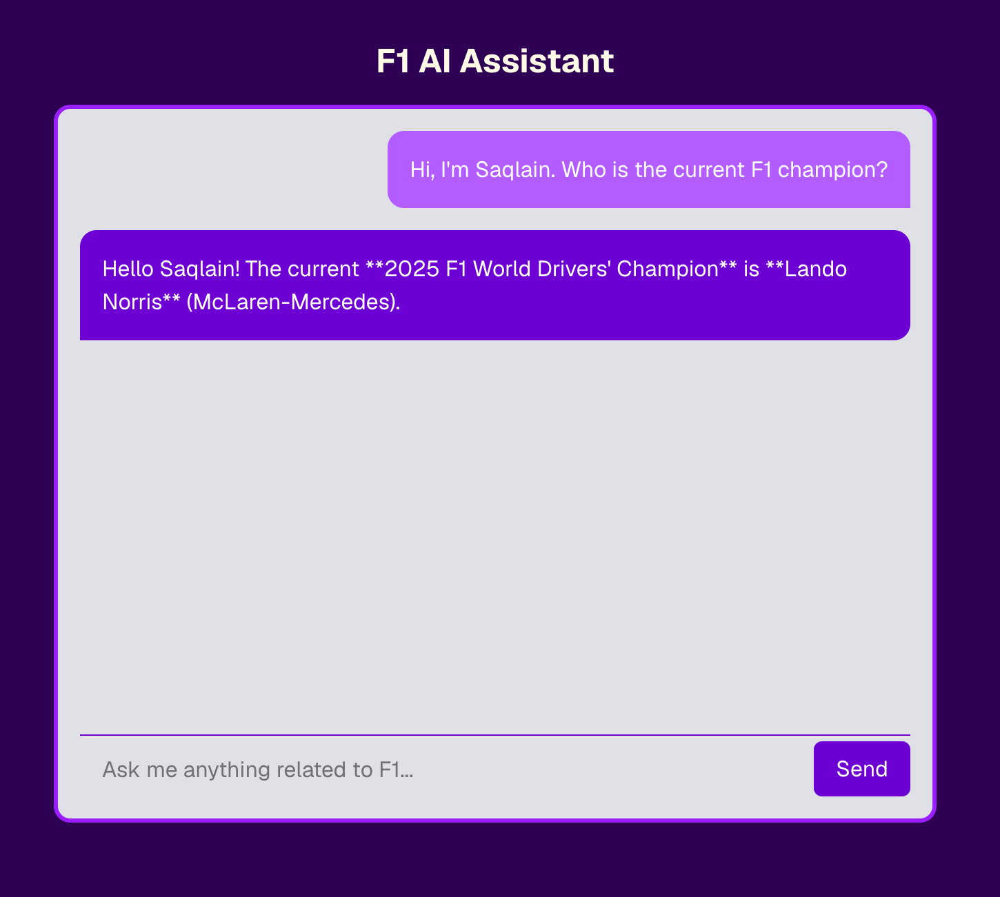
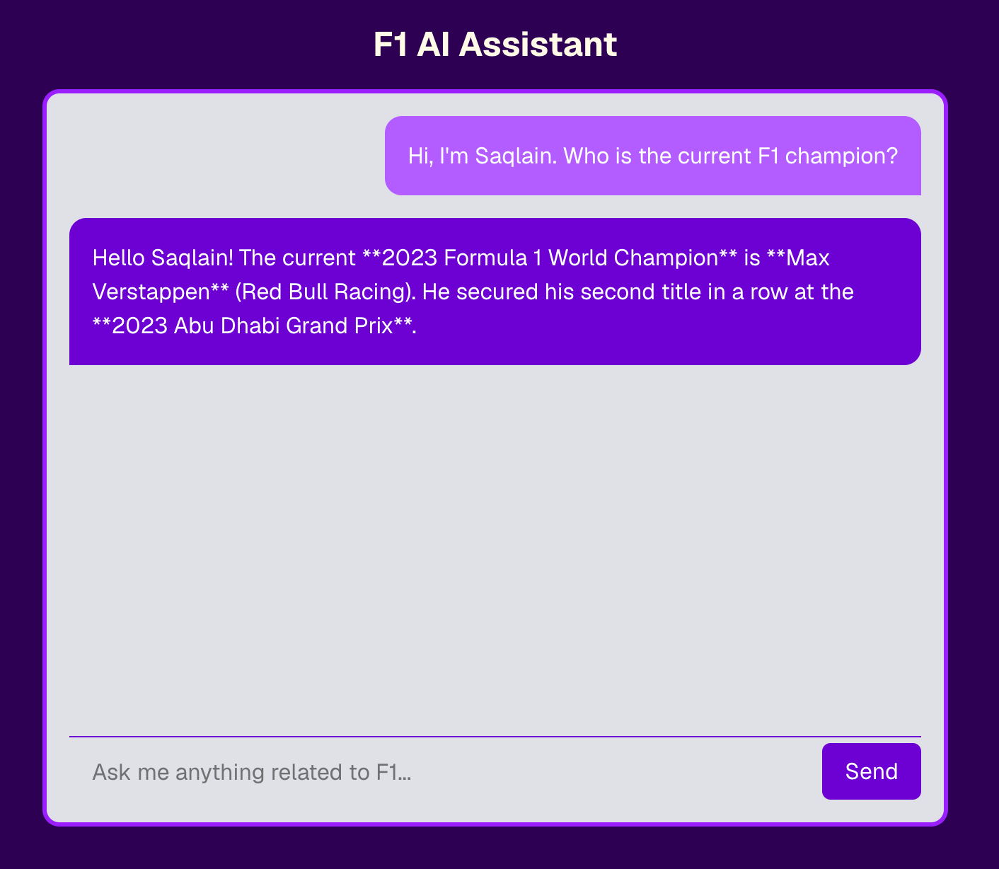
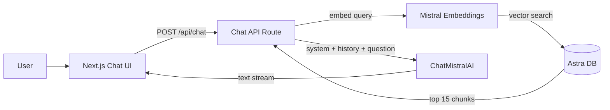

# F1 AI Assistant

A streaming Formula 1 chatbot built with **Next.js**, **LangChain.js**, **Mistral AI**, and **DataStax Astra DB**. Ask questions about drivers, teams, circuits, and F1 history — answers are grounded in scraped web content stored as vector embeddings, with multi-turn conversation support.

## RAG in Action

Same question, two different outcomes — with and without retrieved context from Astra DB:

| With RAG context | Without RAG context |
| :---: | :---: |
|  |  |
| Retrieves relevant F1 documents from Astra DB before generating a response | Skips vector search and answers from the model's general knowledge only |

## Features

- **RAG-powered answers** — embeds the latest user message, retrieves similar chunks from Astra DB, and injects them into the system prompt
- **Multi-turn chat** — prior user and assistant turns are passed to the model as LangChain `HumanMessage` / `AIMessage` history
- **Streaming UI** — assistant replies stream token-by-token via the Vercel AI SDK (`TextStreamChatTransport`)
- **Automated knowledge base** — seed script scrapes public F1 sources, chunks text, embeds with Mistral, and loads vectors into Astra
- **Simple chat interface** — user and assistant message bubbles with a loading state on send/stream

## Tech Stack

| Layer            | Technology                                                                 |
| ---------------- | -------------------------------------------------------------------------- |
| Frontend         | Next.js 16, React 19, Tailwind CSS 4                                       |
| Chat UI          | `@ai-sdk/react`, `ai` (`TextStreamChatTransport`)                          |
| LLM & Embeddings | `@langchain/core`, `@langchain/mistralai` (`ChatMistralAI`, embeddings)   |
| Vector DB        | DataStax Astra DB (`@datastax/astra-db-ts`)                                |
| Scraping         | Playwright                                                                 |

**Chat model:** `ministral-14b-2512` (temperature `0.2`). **Embeddings:** Mistral via `MistralAIEmbeddings` (1024-dimensional vectors in Astra).

## How It Works



1. The user sends a message from the chat UI (`useChat` posts a `messages` array to `/api/chat`).
2. The API embeds the **latest** user message with Mistral.
3. Astra DB returns the **15** most similar document chunks (vector sort).
4. Chunks are serialized into the system prompt; earlier turns are supplied via a `MessagesPlaceholder`; the current question is the final human turn.
5. `ChatMistralAI` streams plain text through LangChain's `StringOutputParser`, and the UI renders the stream live.

If retrieved context does not contain the answer, the system prompt instructs the model to fall back to its own knowledge and conversation history (without citing sources or context limits).

## Prerequisites

- **Node.js** 20+
- **Mistral AI** API key — [console.mistral.ai](https://console.mistral.ai/)
- **DataStax Astra DB** — [astra.datastax.com](https://astra.datastax.com/)
    - A database with Serverless Vector Search enabled
    - An application token with read/write access
- **Playwright Chromium** (for the seed script)

## Getting Started

### 1. Clone and install

```bash
git clone <your-repo-url>
cd f1-ai-langchain
yarn install
# or: npm install
```

Install the Playwright browser used by the scraper:

```bash
npx playwright install chromium
```

### 2. Configure environment variables

Copy `.env.example` to `.env.local` and fill in your values:

```bash
cp .env.example .env.local
```

```env
# Mistral AI
MISTRAL_API_KEY=your_mistral_api_key

# DataStax Astra DB
ASTRA_DB_API_ENDPOINT=https://<database-id>-<region>.apps.astra.datastax.com
ASTRA_DB_APPLICATION_TOKEN=AstraCS:...
ASTRA_DB_NAMESPACE=default_keyspace
ASTRA_DB_COLLECTION=f1_docs
```

| Variable                       | Description                                           |
| ------------------------------ | ----------------------------------------------------- |
| `MISTRAL_API_KEY`              | API key for Mistral chat and embedding models         |
| `ASTRA_DB_API_ENDPOINT`        | Astra DB API endpoint URL for your database           |
| `ASTRA_DB_APPLICATION_TOKEN` | Application token with access to the database         |
| `ASTRA_DB_NAMESPACE`           | Astra keyspace / namespace (often `default_keyspace`) |
| `ASTRA_DB_COLLECTION`          | Collection name for storing F1 document vectors       |

### 3. Seed the vector database

The seed script creates the collection, scrapes F1 content, splits it into chunks, generates embeddings, and inserts them into Astra DB.

Default sources scraped by `scripts/loadDB.ts`:

- [Formula One (Wikipedia)](https://en.wikipedia.org/wiki/Formula_One)
- [List of F1 World Drivers' Champions (Wikipedia)](https://en.wikipedia.org/wiki/List_of_Formula_One_World_Drivers%27_Champions)
- [BBC Sport F1 article](https://www.bbc.com/sport/formula1/articles/c5yeln1j175o)

```bash
yarn seed
# or: npm run seed
```

> **Note:** The seed script calls `createCollection` before inserting data. If the collection already exists, you may need to delete it in the Astra UI or adjust the script before re-running.

Embedding requests are batched (64 chunks) with automatic retry on rate limits. Chunking uses `RecursiveCharacterTextSplitter` with `chunkSize: 512` and `chunkOverlap: 100`.

### 4. Run the development server

```bash
yarn dev
# or: npm run dev
```

Open [http://localhost:3000](http://localhost:3000) and start chatting.

## Scripts

| Command      | Description                                            |
| ------------ | ------------------------------------------------------ |
| `yarn dev`   | Start the Next.js development server                   |
| `yarn build` | Create a production build                              |
| `yarn start` | Run the production server                              |
| `yarn lint`  | Run ESLint                                             |
| `yarn seed`  | Scrape F1 pages, embed content, and load into Astra DB |

## Project Structure

```
f1-ai-langchain/
├── app/
│   ├── api/chat/route.ts    # RAG + LangChain streaming chat endpoint
│   ├── components/
│   │   ├── Bubble.tsx       # User / assistant message bubbles
│   │   └── LoadingBubble.tsx
│   ├── layout.tsx
│   ├── page.tsx             # Chat UI (useChat + TextStreamChatTransport)
│   └── globals.css
├── scripts/
│   └── loadDB.ts            # Scrape, chunk, embed, and seed Astra DB
├── public/
│   └── readme/              # README screenshots (with/without RAG)
├── .env.example
├── package.json
└── README.md
```

## API

### `POST /api/chat`

Accepts a JSON body with a message array (`role` + `content` strings). The UI maps AI SDK message parts to this shape before sending.

```json
{
    "messages": [
        { "role": "user", "content": "Who won the 2023 F1 championship?" },
        { "role": "assistant", "content": "Max Verstappen won the 2023 title." },
        { "role": "user", "content": "Which team was he driving for?" }
    ]
}
```

Only the **last** message is embedded for vector search; all preceding messages are included as conversation history.

Returns a **streaming plain-text** response (`Content-Type: text/plain; charset=utf-8`) compatible with `TextStreamChatTransport`. Request abort (`req.signal`) is forwarded to the LangChain stream.

## Customization

- **Add data sources** — edit the `DATA_SOURCES` array in `scripts/loadDB.ts`, then re-run `yarn seed`.
- **Chunk size** — adjust `chunkSize` and `chunkOverlap` in the `RecursiveCharacterTextSplitter` config inside `scripts/loadDB.ts`.
- **Retrieval count** — change the `limit` in the vector search inside `app/api/chat/route.ts` (default: `15`).
- **Model and sampling** — update `model` and `temperature` on `ChatMistralAI` in `app/api/chat/route.ts`.
- **System prompt** — modify the F1 assistant template in `app/api/chat/route.ts`.

## License

Private project.
